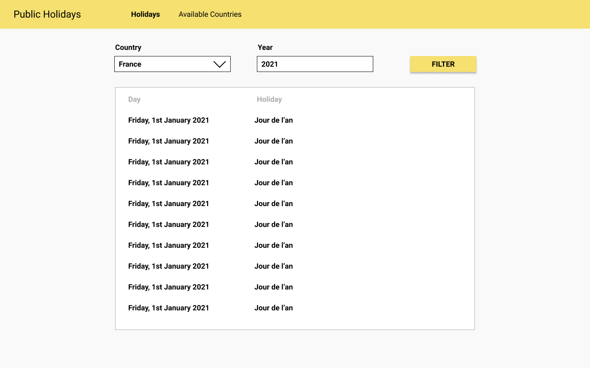
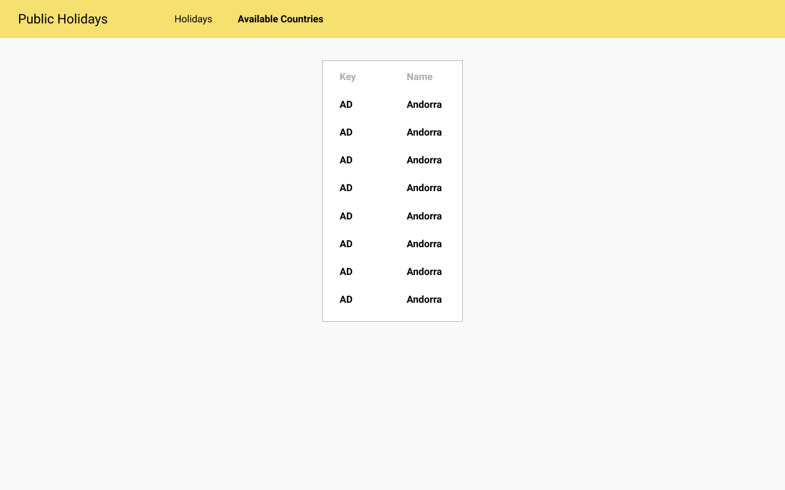

# Technical test React

> For confidentiality reasons, please do not fork this repository from GitHub. Create a new private repository on your account.

Hi 👋
---

This is an exercice about React.

Thank you for taking the time to make it. We appreciate it.

## Goals

This exercise is the occasion for you to

- Give us an overview of your **thinking**
- Demonstrate the **redability** of your code
- Maybe learn tools you don't know yet
- Have this work as a support to discuss technical topics

## Getting started

This project uses create-react-app. Detailled documentation is available on [REACT.md](./REACT.md) or on the [CRA website](https://create-react-app.dev/)

1. Install yarn
1. Run `yarn install` to get your dependencies installed
1. Run `yarn start` to run the app in development mode

You should get the frontend app on http://localhost:3000

## Work to do

We'd like you to create an app that lists all the public holidays around the world.

To do that, you will request the [free Nager Date API](https://date.nager.at/API). Its Swagger documentation is available [here](https://date.nager.at/swagger/index.html).

Using React hooks and the Nager API, you will create the following two pages.

Any improvement (pagination, offline support, UX, tests...) will be welcomed, even if it is not required.

### List the holidays for one year on one country (/holidays/{countrycode}/{year})

This page will list all the holidays in a country for a given year.
It will also include a filtering form to select a new country or a new year.

### List the available countries (/countries)

This page will show in a table all the countries supported by the API.

## Any question ?

If some points aren't clear to you, no worries we can have a quick chat.
Send me an email at maxime@scoppe.fr.

## When you're done

Share your repository with @maximelebastard on GitHub and drop an email to maxime@scoppe.fr.